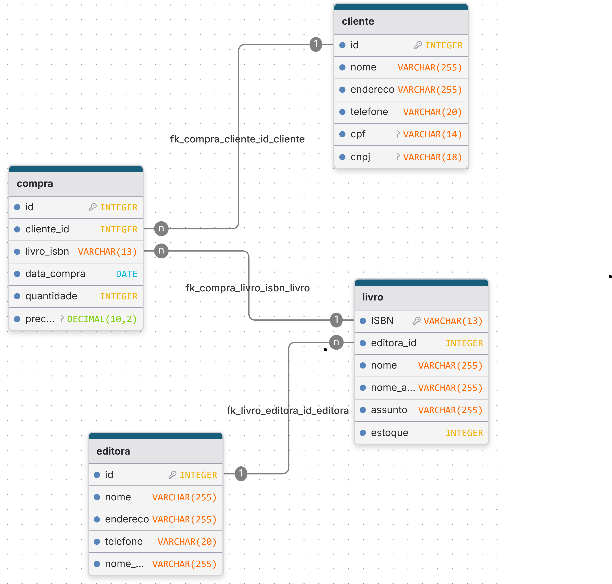

# Sistema de Gerenciamento de Livraria

Este projeto é um sistema de gerenciamento de livraria em Java, desenvolvido para a disciplina de Programação Orientada a Objetos 1.

## ✨ Funcionalidades

*   Gerenciamento de clientes, livros, editoras e compras.
*   Controle de estoque.

## 🛠️ Tecnologias

*   Java
*   MySQL


## 📊 Modelagem de Dados



## 🚀 Como Executar

1.  **Clone o repositório.**

2.  **Configure o banco de dados:**
    *   Crie um banco de dados MySQL.
    *   Execute o script `database/main.sql`.
    *   Configure a conexão em `resources/application.properties` (use `resources/application.properties.example` como referência).

3.  **Compile o projeto:**
    *   Certifique-se de que todos os arquivos `.java` em `src/` foram compilados para a pasta `bin/`. Você pode usar o seguinte comando a partir da raiz do projeto:
```bash
  javac -d bin -cp "lib/mysql-connector-j-9.4.0.jar;src" src/application/Main.java src/application/usecases/*.java src/domain/entities/*.java src/domain/repositories/*.java src/domain/utils/*.java src/infrastructure/db/*.java src/infrastructure/repositories/*.java src/presentation/controllers/*.java
```

4.  **Execute o projeto:**
    *  Execute o projeto com o seguinte comando:
```bash
  java -cp "bin;lib/mysql-connector-j-9.4.0.jar" application.Main
```

## 📂 Estrutura do Projeto

*   `src/domain`: Entidades de negócio e interfaces dos repositórios.
*   `src/application`: Casos de uso da aplicação.
*   `src/infrastructure`: Implementação dos repositórios e configuração do banco de dados.
*   `src/presentation`: Controladores da interface com o usuário.